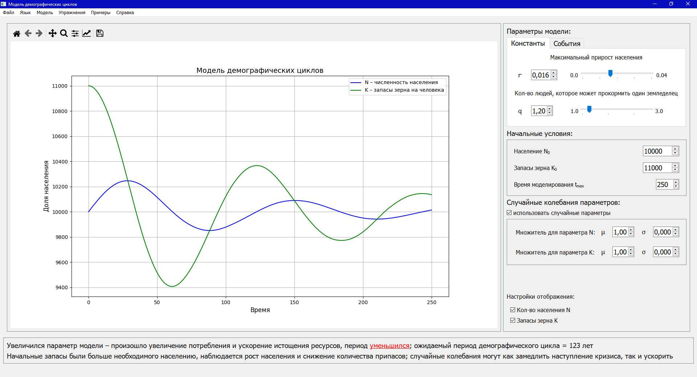
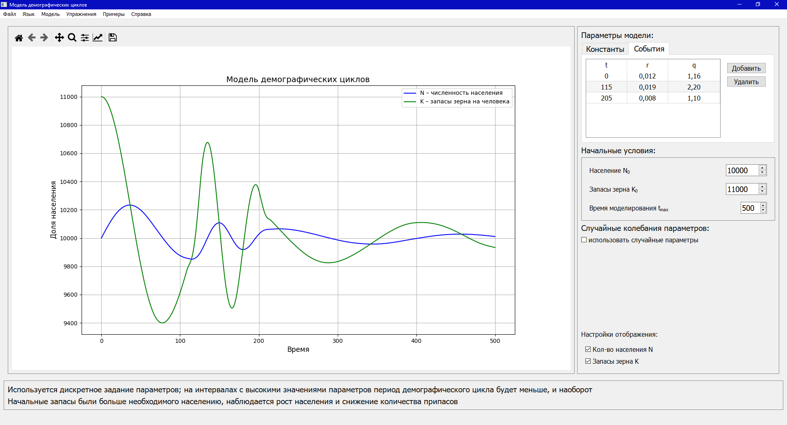

# Программная реализация математической модели демографических циклов
Учебный проект, графическое приложение для визуализации математической модели демографических циклов в аграрном обществе, автор модели – Нефёдов С. А. Математические модели демографических циклов // МЕТОД: Московский ежегодник трудов из обществоведческих дисциплин. 2011. №2.

## Математическая модель
Описывается системой уравнений:
$$ \begin{cases}
    \frac {dN}{dt} = rN(1 - \frac N K)    \\
    \frac {dK}{dt} = \frac {aN}{N + d} - N
  \end{cases}$$
где $N(t)$ – численность популяции в момент $ t$, $r$ – максимальный естественный прирост в благоприятных условиях, $K(t)$ – запасы зерна после сбора урожая, исчисляемые количеством минимальных годовых пайков (это то же самое, что и максимальная численность населения, которая может прокормиться на существующих запасах до следующего урожая), $ a$ – некоторая константа, определяемая максимальной посевной площадью, находящейся во владении земледельческого сообщества.

Параметрами модели являются $r$ (максимальный естественный прирост) и величина $q = \frac{a}{d}$ (сколько человек может в благоприятных условиях прокормить один земледелец), начальными условиями являются некоторые константы $ N_0$ и $ K_0$.

Более подробные описания математической и компьютерной модели содержатся в интерфейсе программы; доступны на русском и английском языках.

## Требования и зависимости
Для запуска и использования необходимы следующие компоненты:
* Python 3.9+
* PySide6 (Qt6) – графический интерфейс
* numpy – математические вычисления
* scipy – численные методы
* matplotlib – отображение графиков

Для использования приложения можно установить виртуальное окружение Python, установить необходимые пакеты, сгенерировать модули, затем запустить основной файл, например:
```
> python -m venv .venv
> .venv\Scripts\activate.bat
> pip install -r requirements.txt
> scripts\build_all.bat
> python main_top.py
```
## Использование
### Интерфейс

Доступен на двух языках: русский и английский.

В центральной части экрана расположен график, отображающий численное решение системы уравнений. 

Справа находятся настройки модели, среди них:
* параметры модели
* начальные условия системы дифференциальных уравнений
* опциональные настройки случайных влияний
* настройки отображения графиков

Снизу расположены текстовые строки с интерпретацией текущего состояния модели, в частности, влияние на модель последнего параметра, изменённого пользователем, и динамика модели в зависимости от начальных условий.



Пользователь может двигать слайдеры, изменяя значения параметров, при этом система автоматически пересчитывается, а график перерисовывается. Этим действиям даётся интерпретация в рамках модели.

### Методы задания параметров
Реализовано два метода задания параметров:
* константный – параметры остаются постоянными в течение всего периода моделирования
* дискретно-событийный – параметры задаются в виде событий на временной шкале, задавая некоторые интервалы, на которых параметры будут постоянными. Такой подход является более гибким и приближённым к реальности для задачи моделирования 



На этом рисунке показано три временных интервала.

### Упражнения
Для лучшего понимания модели пользователю предлагается два упражнения, в которых необходимо подобрать значения параметров, чтобы достичь некоторого результата.

### Примеры
Предлагается три демонстрационных примера, представляющих собой некоторые заготовленные комбинации параметров и режимов.